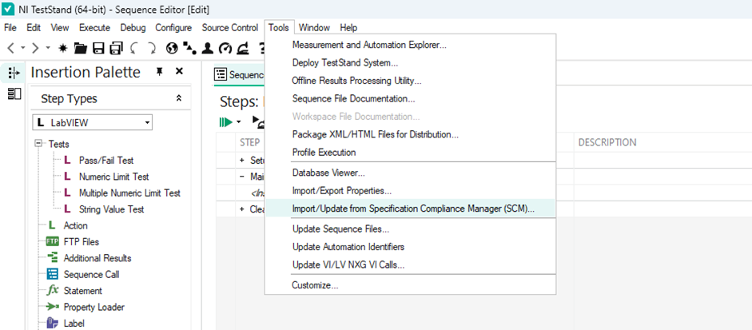
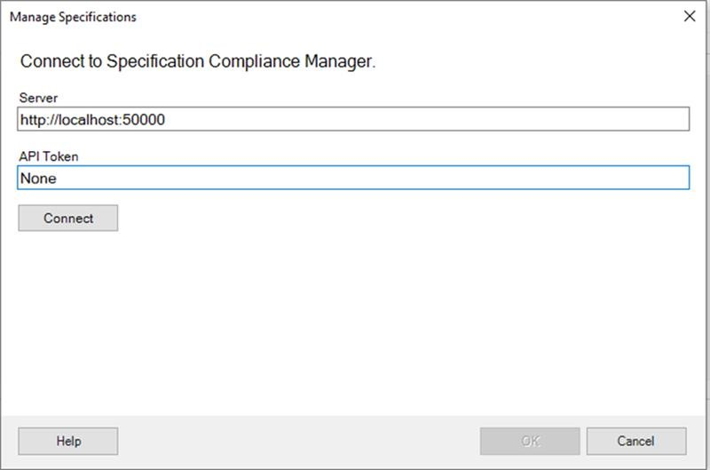
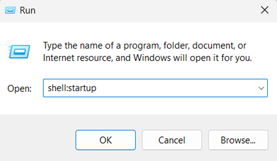
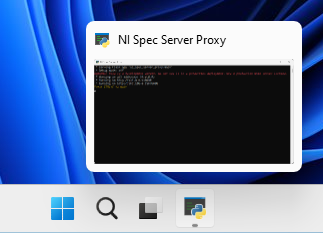

# Spec Server Proxy

- [Spec Server Proxy](#spec-server-proxy)
  - [Introduction](#introduction)
  - [Dependencies](#dependencies)
  - [How to install?](#how-to-install)
  - [How to run?](#how-to-run)
  - [Steps to communicate with SLE using TestStand](#steps-to-communicate-with-sle-using-teststand)
    - [Set up the SystemLink Client](#set-up-the-systemlink-client)
    - [NI TestStand](#ni-teststand)
  - [How to start the proxy service on windows startup automatically?](#how-to-start-the-proxy-service-on-windows-startup-automatically)
    - [Note](#note)

## Introduction

- The Spec Server Proxy is a Python server that extracts product specifications and uploads measurement data to SystemLink Enterprise (SLE) using the NI Specification Compliance Manager (SCM) Server's APIs. This enables user applications built for the NI SCM Server to work with SLE without application-side changes.

## Dependencies

- Python 3.8.5
- systemlink-sdk = "^24.0.0"

  The above dependencies are satisfied by installing [SystemLink Client](https://www.ni.com/en/support/downloads/software-products/download.systemlink-client.html) with `Python SDK` option checked.

## How to install?

- Open Command Prompt.
- Run the following command to install the Python package.

  ```cmd
  "C:\Program Files\National Instruments\Shared\Skyline\Python\3.8\python.exe" -m pip install ni_spec_server_proxy-x.y.z-py3-none-any.whl
  ```

## How to run?

- Run [ni_spec_server_proxy.bat](batch_files/ni_spec_server_proxy.bat) to run server.

  Or

- Open Command Prompt.
- Start the server by using the following command.

  ```cmd
  "C:\Program Files\National Instruments\Shared\Skyline\Python\3.8\python.exe" -m ni_spec_server_proxy
  ```

## Steps to communicate with SLE using TestStand

### Set up the SystemLink Client

- Launch NI SystemLink Client and connect to SystemLink Enterprise as per the [instruction](https://www.ni.com/docs/en-US/bundle/systemlink-enterprise/page/setting-up-systemlink-client.html#:~:text=Search%20for%20and%20install%20NI,which%20you%20want%20to%20connect.)
  - If the version of SystemLink Enterprise (SLE) is 2024-04 or older, then update the API key in the `http_master.json` file located at, `C:\ProgramData\National Instruments\Skyline\HttpConfigurations\http_master.json`.
  - Refer to the [instructions to Create an API key](https://www.ni.com/docs/en-US/bundle/systemlink-enterprise/page/creating-an-api-key.html).
- Run the NI Spec Server Proxy. Refer to [How to run?](#how-to-run)

### NI TestStand

- Launch NI TestStand Sequence Editor.
- Click `Tools`.
- Click `Import/Update from Specification Compliance Manager (SCM)`.

  

- In the opened dialog box, enter Server URL as `http://localhost:50000/`.
- No API key is required.

  

- Click `Connect` to connect to NI Spec Server Proxy. Ensure the NI Spec Server Proxy server is running before connecting.
- Once the server is connected, the Product drop-down lists the PartNumber available in SystemLink Enterprise.
- Select a PartNumber and select the categories to import the specifications.
- Use the specification details imported into FileGlobals.SCM_Specifications in the Test Sequence for Test Automation and measurement data logging with test conditions using the TestStand SCM Integration Workflow.

## How to start the proxy service on windows startup automatically?

- Download the [ni_spec_server_proxy.bat](batch_files/ni_spec_server_proxy.bat) from this repository.
- Press **Win + R** to open the Run dialog.
- Type **shell:startup** and press Enter.

  

- The Startup folder opens.
- Place the `ni_spec_server_proxy.bat` file in the Startup folder.
- This batch file will be automatically executed whenever the Personal Computer gets powered on.

### Note

- Closing the NI Spec Server Proxy console window will terminate the service.

  
