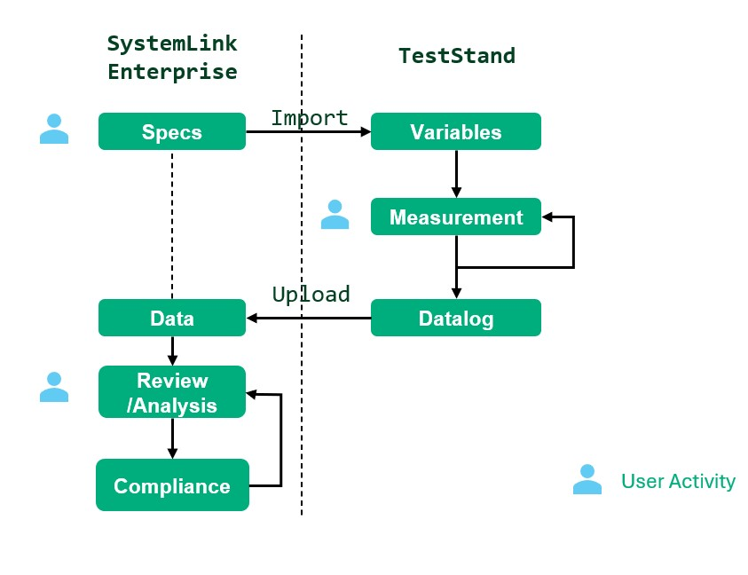
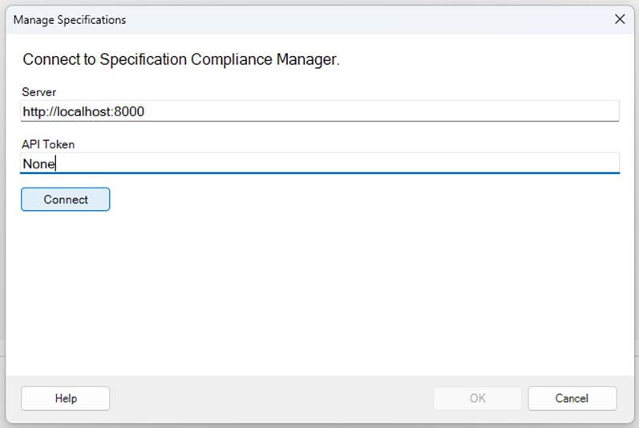
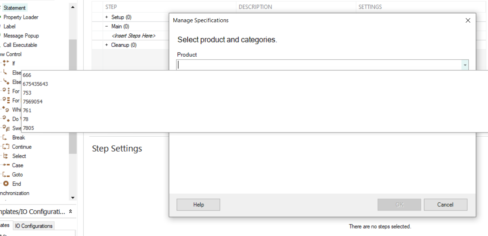
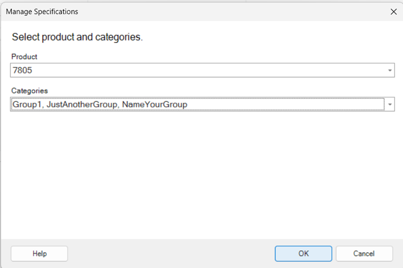
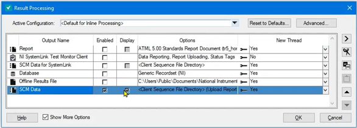
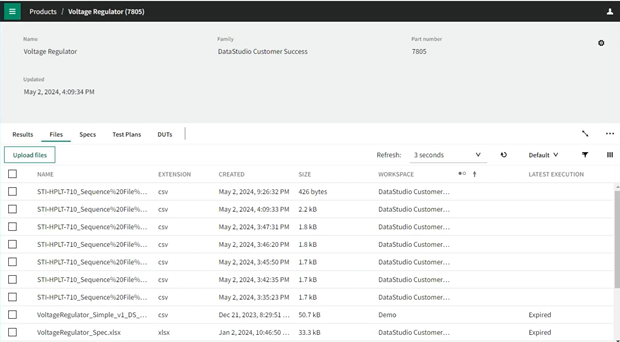

# NI Spec Server Proxy

- [NI Spec Server Proxy](#ni-spec-server-proxy)
  - [Who](#who)
  - [Problem Statement](#problem-statement)
  - [Implementation and Design](#implementation-and-design)
    - [Dependencies - NI Python Packages](#dependencies---ni-python-packages)
    - [API](#api)
    - [Get Products](#get-products)
      - [Key Changes](#key-changes)
      - [SCM Server Response](#scm-server-response)
      - [SLE Server Response](#sle-server-response)
      - [Proxy Server Response](#proxy-server-response)
    - [Get Specifications](#get-specifications)
      - [Key Changes](#key-changes-1)
      - [SCM Server Response](#scm-server-response-1)
      - [SLE Server Response](#sle-server-response-1)
      - [Proxy Server Response](#proxy-server-response-1)
    - [Upload BDC file](#upload-bdc-file)
      - [Key Changes](#key-changes-2)
      - [SCM Server Response](#scm-server-response-2)
      - [SLE Server Response](#sle-server-response-2)
      - [Proxy Server Response](#proxy-server-response-2)
    - [Architecture Diagram](#architecture-diagram)
    - [Installation of NI Spec Server Proxy](#installation-of-ni-spec-server-proxy)
    - [Connection Establishment with SLE](#connection-establishment-with-sle)
    - [Get products](#get-products-1)
    - [Get specification](#get-specification)
    - [Upload BDC file.](#upload-bdc-file-1)
  - [Alternative Implementations and Designs](#alternative-implementations-and-designs)
  - [Open Issues](#open-issues)
  - [Future Plans](#future-plans)

## Who

Author: National Instruments <br/>
Team: ModernLab Success

## Problem Statement

Currently there is no workflow to exchange data between SystemLink Enterprise (SLE) and NI TestStand.

## Implementation and Design

NI TestStand has a workflow to exchange data with the Specification Compliance Manager (SCM) using SCM APIs.

So, the solution is to create a python server to act as a proxy which redirects the SCM server requests to SLE server without affecting the TestStand - Specification Compliance Manager workflow.

To create a python server, Flask framework will be used. The flask server will be running locally in the port 8000. The server can be accessed at http://localhost:8000

### Dependencies - NI Python Packages

The python server uses the NI Python packages like `SystemLink Python Clients` and `SystemLink SDK` to make requests to the SLE server. These packages will be installed during the installation of `SystemLink Client`

### API

The API calls to the SCM server will be redirected to the equivalent SLE server.

The below table shows the API endpoints of SCM and its equivalent in SLE that will be used.

| Data Exchange      | SCM API                                                                    | Equivalent SLE API                                                                                 |
| ------------------ | -------------------------------------------------------------------------- | -------------------------------------------------------------------------------------------------- |
| Get Products       | `/niscm/public/products`                                                   | `/v2/products`                                                                                     |
| Get Specifications | `/niscm/public/spec/<product_name>/<product_revision>`                     | `/nispec/v1/query-specs`                                                                           |
| Upload BDC file    | `/niscm/public/data/upload/<product_name>/<product_revision>/<discipline>` | `/v1/service-groups/Default/upload-files` <br/> To link the file to product: `/v2/update-products` |

To access the SLE APIs, a user needs the `SLE URL`, `API key` and `Workspace ID`. Once the connection with SLE is established using the SystemLink Client, this information can be found in the following path,
- URL and API Key - `"C:\ProgramData\National Instruments\Skyline\HttpConfigurations\http_master.json"`
- WorkspaceID - `"C:\ProgramData\National Instruments\salt\conf\grains"`

As the SCM APIs have different request and response format when compared with their counterparts in SLE, the response from SLE APIs will be converted to SCM APIs' response format.

### Get Products

#### Key Changes

`partNumber` is used from SLE server response as `productName` in Proxy server response.

#### SCM Server Response
```
{ 
  "data": [ 
    {
      "productName": "ADV1234",
      "id": 123,
      "bu": "Amplifiers" ,
      "revision": "pg2.1", 
      "userID": "Adam",
      "productOwner": "Adam",  
      "isActive": true,  
      "numberOfSpecs": 0,  
      "failedSpecCount": 0 
      } 
    ],  
    "message": "Success or a failure message text.",  
    "state": 0
}
```

#### SLE Server Response

```
{ 
"products": [
  {
    "id": "02600cf8-c2bb-4ff9-a139-031e943fb0c0", 
    "partNumber": "156502A-11L", 
    "name": "cRIO-9030", 
    "family": "cRIO", 
    "updatedAt": "2018-05-09T15:07:42.527921Z", 
    "keywords": [ "keyword1", "keyword2" ],
    "properties":  {"key1": "value1" },
    "fileIds": [ "5e30934193cac8046851acb2"], 
    "workspace": "f94b178e-288c-4101-afb1-833992413aa7"
  }
], 
"continuationToken": "token", 
"totalCount": 1 
}                                                                                                                                                                                                                       
```

#### Proxy Server Response

```
{
  "data: [
   {
    "productName": partNumber,  
    "revision": 1.0,
   } 
  ]  
   "message": `All Views fetched successfully`, 
   "state":`0`
}  
```

### Get Specifications

#### Key Changes

`partNumber` is used from SLE server response as `productName` in Proxy server response.
Conditions and Info columns are processed to comply with SCM server's response.

#### SCM Server Response

```
{
  "data": [
    {
      "specID": "SPEC01",
      "category": "Electrical characteristics",
      "block": "Test",
      "specSymbol": "Ibat",
      "specName": "Normal mode current",
      "specType": "Parametric",
      "min": 3.3,
      "typical": 100.5,
      "max": 500,
      "unit": "µA",
      "lastComplianceUpdatedTimeForSpec": "2021-06-16 12:57:19.9019497 +05:30",
      "conditions": [
        {
          "columnName": "Temperature(deg F)",
          "columnValue": "40"
        }
      ],
      "info": [
        {
          "columnName": "Waveform",
          "columnValue": "./path/to/waveform01.tdms"
        }
      ],
      "id": 0
    }
  ],
  "message": "Success or a failure message text.",
  "state": 0
}
```

#### SLE Server Response

```
{
  "specs": [
    {
      "productId": "110ac9e8-4187-9870-a0b4-10dabfa02a0e",
      "specId": "Vsat01",
      "name": "Saturation voltage",
      "category": "Electrical characteristics",
      "type": "PARAMETRIC",
      "symbol": "VSat",
      "block": "USB",
      "limit": {
        "min": -66.54,
        "typical": 180,
        "max": 303.659
      },
      "unit": "mV",
      "conditions": [
        {
          "name": "InputVoltage",
          "value": {
            "conditionType": "NUMERIC",
            "range": [
              {
                "min": 50,
                "max": 600,
                "step": 25.55
              }
            ],
            "discrete": [
              -55,
              66.6
            ],
            "unit": "mV"
          }
        }
      ],
      "keywords": [
        "Test specification only",
        "First"
      ],
      "properties": {
        "Product manager": "Jim",
        "Spec owner": "Jacob"
      },
      "workspace": "990ac9e8-41ac-9870-a0b4-10dddfa02a0e",
      "id": "6dfb2ce3741fe56d88838cc9",
      "createdAt": "2018-05-09T15:07:42.527921Z",
      "createdBy": "0a9ca97e-23fc-4d71-b47e-e34b7a930f42",
      "updatedAt": "2018-05-09T15:07:42.527921Z",
      "updatedBy": "0a9ca97e-23fc-4d71-b47e-e34b7a930f42",
      "version": 0
    }
  ],
  "continuationToken": "string"
}
```

#### Proxy Server Response

```
{ 
  "data": [ 
    {
      "specID": "SPEC01",   
      "category": "Electrical characteristics",   
      "block": "Test",  
      "specSymbol": "Ibat", 
      "specName": "Normal mode current", 
      "specType":"Parametric", 
      "min": 3.3, 
      "typical": 100.5, 
      "max": 500, 
      "unit": "µA", 
      "conditions": [ 
        { 
          "columnName":"Temperature(deg F)", 
          "columnValue": "40" 
        }
      ], 
      "info": [ 
        {
          "columnName": "Waveform", 
          "columnValue": "./path/to/waveform01.tdms" 
        }
      ], 
    } 
  ], 
  "message": "All Views fetched successfully.", 
  "state": 0 
}
```

### Upload BDC file

#### Key Changes

Process History ID is always `12345` as it is not used further in SLE server.

#### SCM Server Response

```
{
"data": {
    "fileName": "file.csv",
    "processHistoryID": 0,
    "errors": [
      {
        "lineNumber": 2,
        "errorCode": 0,
        "description": "Invalid column type."
      }
    ]
  },
  "message": "Success or a failure message text.",
  "state": 0
}
```

#### SLE Server Response

```
{
  "uri": "/nifile/v1/service-groups/Default/files/5b874c4adedd0f1c78a22a96"
}
```

#### Proxy Server Response

```
{
  "data": {
    "fileName": filename, 
    "processHistoryID": `12345`,
    "errors": `[]`
  }, 
  "message": `File uploaded successfully.`,
  "state":`0` 
}
```

For upload BDC file, the uploaded file will be stored locally under a directory called `Measurement CSV Files` in the current working directory.

NI TestStand BDC file name format is as follows
`[StationID][SequenceFile][Data][Time][BatchSerialNumber][UUTSerialNumber][TestSocket].csv`

The name of the uploaded file will be sanitized as follows to avoid encoding errors. If it is uploaded with the above file name, the square brackets will not be displayed properly. That is, it will be displayed with its ASCII values instead of square brackets.
- `[` will be replaced with `""`
- `]` will be replaced with `_`

The BDC file will contain the `STD` and `COND` columns. The Proxy server will add two more `META` columns called `TestBench` and `ChipId` for future use.

The column `TestBench` will be filled with `minion id`. The `minion id` can be found in the following path `"C:\ProgramData\National Instruments\salt\conf\minion_id"`.

The column `ChipId` will be filled with `UUT Serial Number` if it is available in the file name. If `UUT Serial Number` is not available in the file name, the column `ChipId` will be left empty.

The BDC file upload to SCM server involves two API calls.
- One request for uploading the file to SCM server.
- One request for verifying the status of the uploaded file.

So, whenever there is a file upload request, it is followed by another request to know the status of the file upload.

But SLE server doesn't have equivalent API to process execution status API of SCM.
To respond to the process execution status API request, NI Spec Server Proxy will always respond with a successful response.

In SCM the file is directly uploaded to a product. But in SLE the file is uploaded to server and then required to be linked with a product. So the file id from the upload API response is used to link it to the product using another API `/v2/update-products`.

Example Response:
{
"uri": "/nifile/v1/service-groups/Default/files/`5b874c4adedd0f1c78a22a96`"
}


### Architecture Diagram

The below picture shows data flow between SystemLink Enterprise and TestStand.



### Installation of NI Spec Server Proxy

- It is mandatory to establish a connection with SLE using SystemLink Client. Follow the steps to set up [NI SystemLink Client](https://www.ni.com/docs/en-US/bundle/systemlink-enterprise/page/setting-up-systemlink-client.html#:~:text=Search%20for%20and%20install%20NI,which%20you%20want%20to%20connect)

- NI Spec Server Proxy Python Package has to be installed in NI SystemLink Client's Python Site Packages as it requires NI Python packages like `SystemLink Python Client` and `SystemLink SDK`.

- Run the command to install the whl file,
`"C:\Program Files\National Instruments\Shared\Skyline\Python\3.8\python.exe" -m pip install ni_spec_server_proxy-X_X_X-py3-none-any.whl`

### Connection Establishment with SLE

- Launch NI SystemLink Client and connect to SystemLink Enterprise as per [instructions](https://www.ni.com/docs/en-US/bundle/systemlink-enterprise/page/setting-up-systemlink-client.html)

  - Configurations will be taken from SystemLink Clients.

  - If the SLE version is 2024-04 or older, update the API key in the master.json file at - "C:\ProgramData\National Instruments\Skyline\HttpConfigurations\http_master.json".

  - Refer to the [instructions to create an API key](https://www.ni.com/docs/en-US/bundle/systemlink-enterprise/page/creating-an-api-key.html)

- Run spec-server-proxy.bat file to run the server.
- Open NI TestStand Sequence Editor.
- Select *Tools > Import/Update from Specification Compliance Manager (SCM)* from the TestStand Sequence Editor menu bar.


- Enter the credentials in the dialog box,
  - Server - http://localhost:8000
  - API token - None



- On Clicking on the *Connect* button, it should be connected to Proxy Server.

### Get products

- After the establishment of connection, all the products' PartNumber available in the SLE server should be listed down.



### Get specification

- On selecting a PartNumber and Category from the dropped down list, the specifications available in the selected product should be loaded.



- The available specifications in the product should be imported into FileGlobals.SCM_Specifications in TestStand.

### Upload BDC file.

On following the below steps, BDC file generated by TestStand should be uploaded to SLE server.

- Ensure SCM Data in Result Processing is enabled.



- In TestStand, create a simple sequence which generates random numbers as measurement for a spec.
- Run the sequence to generate and upload the measurement to SLE.
- Once the sequence is run, the user can view the measurements as BDC files in the respective product under *Files* tab in SLE.
- A folder will be created with all the measurement files called `Measurement CSV Files` in the current working directory where the proxy server is running.



- If user has created a routine in SLE which converts the BDC file to Test Result, then the routine will be triggered and it creates a test result and steps using the file. The result will be available under the *Results* tab of the same product.

## Alternative Implementations and Designs

No alternative implementations.

## Open Issues

- Socket error will be raised if the port 8000 is already in use.

## Future Plans

- Allow user to dynamically select the port.