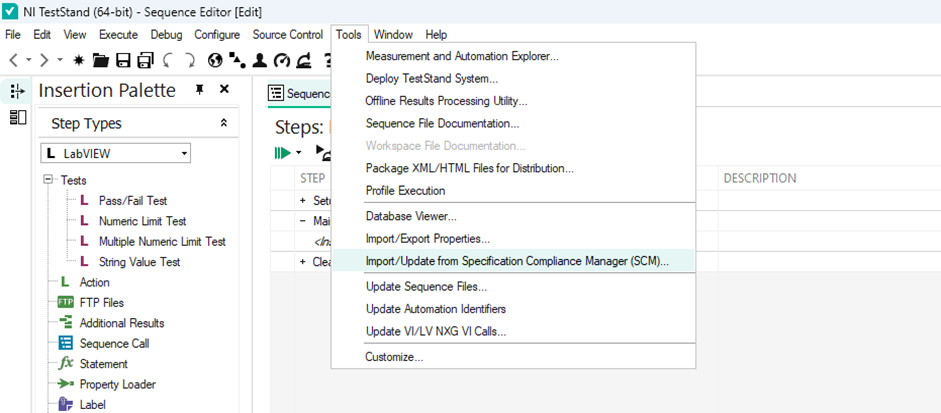

# NI Spec Server Proxy

- [NI Spec Server Proxy](#ni-spec-server-proxy)
  - [Who](#who)
  - [Problem Statement](#problem-statement)
  - [Implementation and Design](#implementation-and-design)
    - [Dependencies - NI Python Packages](#dependencies---ni-python-packages)
    - [API](#api)
    - [Architecture Diagram](#architecture-diagram)
    - [Installation of NI Spec Server Proxy](#installation-of-ni-spec-server-proxy)
    - [Connection Establishment with SLE](#connection-establishment-with-sle)
    - [Get products](#get-products)
    - [Get specification](#get-specification)
    - [Upload BDC file.](#upload-bdc-file)
  - [Alternative Implementations and Designs](#alternative-implementations-and-designs)
  - [Open Issues](#open-issues)

## Who

Author: National Instruments  
Team: ModernLab Success

## Problem Statement

Currently there is no workflow to exchange data between SystemLink Enterprise (SLE) and NI TestStand.

## Implementation and Design

NI TestStand has a workflow to exchange data with Specification Compliance Manager using SCM APIs.

So, the solution is to create a python server to act as a proxy which redirects the SCM server requests to SLE server without affecting the TestStand-SpecificationComplianceManager (SCM) workflow.

To create a python server, Flask framework will be used. The flask server will be running locally in the port 8000. The server can be accessed at http://localhost:8000

### Dependencies - NI Python Packages

The python server uses the NI Python packages like `SystemLink Python Clients` and `SystemLink SDK` to make requests to the SLE server. These packages will be installed during the installation of `SystemLink Client`

### API

The API calls to the SCM server will be redirected to the equivalent SLE server.

The below table shows the API endpoints of SCM and its equivalent in SLE that will be used.

| Data Exchange      | SCM API                                                                    | Equivalent SLE API                                                                                 |
| ------------------ | -------------------------------------------------------------------------- | -------------------------------------------------------------------------------------------------- |
| Get Products       | `/niscm/public/products`                                                   | `/v2/products`                                                                                     |
| Get Specifications | `/niscm/public/spec/<product_name>/<product_revision>`                     | `/nispec/v1/query-specs`                                                                           |
| Upload BDC file    | `/niscm/public/data/upload/<product_name>/<product_revision>/<discipline>` | `/v1/service-groups/Default/upload-files`   To link the file to product: `/v2/update-products` |

To access the SLE APIs, user need the `SLE URL`, `API key` and `Workspace ID`. Once the connection with SLE is established using the SystemLink Client, this information can be found in the following path,
- URL and API Key - `"C:\ProgramData\National Instruments\Skyline\HttpConfigurations\http_master.json"`
- WorkspaceID - `"C:\ProgramData\National Instruments\salt\conf\grains"`

As the SCM APIs have different request and response format when compared with their counterparts in SLE, the response from SLE APIs will be converted to SCM APIs' response format.

For Get products, the `PartNumber` of SLE product will be used as the Product Name in the response.

For Get Specifications, conditions and info columns in SLE's response will be formatted to comply with SCM's response.

For upload BDC file, the uploaded file will be stored locally under a directory called `Measurement CSV Files` in the current working directory.
The name of the uploaded file will be sanitized as follows
- `[` will be replaced with `""`
- `]` will be replaced with `_`

The BDC file will be added with two columns of type `META` namely `TestBench` and `ChipId`.

The column `TestBench` will be filled with `minion id`. The `minion id` can be found in the following path `"C:\ProgramData\National Instruments\salt\conf\minion_id"`.

The column `ChipId` will be filled with `UUT Serial Number` if it is available in the file name.

NI TestStand BDC file name format is as follows
`[StationID][SequenceFile][Data][Time][BatchSerialNumber][UUTSerialNumber][TestSocket].csv`

If `UUT Serial Number` is not available in the file name, the column `ChipId` will be left empty.

The BDC file upload to SCM server involves two API calls.
- One request for uploading the file to SCM server.
- One request for verifying the status of the uploaded file.

So, whenever there is a file upload request, it is followed by another request to know the status of the file upload.

But SLE server doesn't have equivalent API to process execution status API of SCM.
To respond to the process execution status API request, NI Spec Server Proxy will always respond with a successful response.

### Architecture Diagram

The below picture shows data flow between SystemLink Enterprise and TestStand.

### Installation of NI Spec Server Proxy

- It is mandatory to establish a connection with SLE using SystemLink Client. Follow the steps to set up [NI SystemLink Client](https://www.ni.com/docs/en-US/bundle/systemlink-enterprise/page/setting-up-systemlink-client.html#:~:text=Search%20for%20and%20install%20NI,which%20you%20want%20to%20connect)

- NI Spec Server Proxy Python Package has to be installed in NI SystemLink Client's Python Site Packages as it requires NI Python packages like `SystemLink Python Client` and `SystemLink SDK`.

- Run the command to install the whl file,
`"C:\Program Files\National Instruments\Shared\Skyline\Python\3.8\python.exe" -m pip install ni_spec_server_proxy-X_X_X-py3-none-any.whl`

### Connection Establishment with SLE

- Launch NI SystemLink Client and connect to SystemLink Enterprise as per [instructions](https://www.ni.com/docs/en-US/bundle/systemlink-enterprise/page/setting-up-systemlink-client.html)

  - Configurations will be taken from SystemLink Clients.

  - If the SLE version is 2024-04 or older, update the API key in the master.json file at - "C:\ProgramData\National Instruments\Skyline\HttpConfigurations\http_master.json".

  - Refer to the [instructions to create an API key](https://www.ni.com/docs/en-US/bundle/systemlink-enterprise/page/creating-an-api-key.html)

- Run spec-server-proxy.bat file to run the server.
- Open NI TestStand Sequence Editor.
- Select *Tools > Import/Update from Specification Compliance Manager (SCM)* from the TestStand Sequence Editor menu bar.

- Enter the credentials in the dialog box,
  - Server - http://localhost:8000
  - API token - None

- On Clicking on the *Connect* button, it should be connected to Proxy Server.

### Get products

- After the establishment of connection, all the products' PartNumber available in the SLE server should be listed down.

### Get specification

- On selecting a PartNumber and Category from the dropped down list, the specifications available in the selected product should be loaded.

- The available specifications in the product should be imported into FileGlobals.SCM_Specifications in TestStand.

### Upload BDC file.

On following the below steps, BDC file generated by TestStand should be uploaded to SLE server.

- Ensure SCM Data in Result Processing is enabled.

- In TestStand, create a simple sequence which generates random numbers as measurement for a spec.
- Run the sequence to generate and upload the measurement to SLE.
- Once the sequence is run, the user can view the measurements as BDC files in the respective product under *Files* tab in SLE.

- If user has created a routine in SLE which converts the BDC file to Test Result, then the routine will be triggered and it creates a test result and steps using the file. The result will be available under the *Results* tab of the same product.

- A folder will be created with all the measurement files called `Measurement CSV Files` in the current working directory where the proxy server is running.

## Alternative Implementations and Designs

No alternative implementations.

## Open Issues

No open issues.